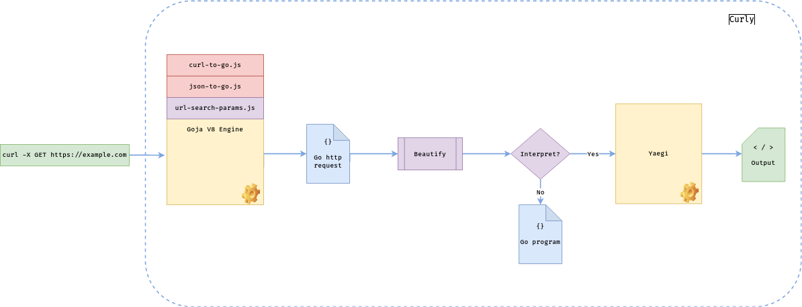

curly
=====

[curl-to-go](https://github.com/mholt/curl-to-go) port with the power of Golang.

This is fun project which converts `curl` command to Golang code with ability of its further execution.

The idea is to re-use existing tools as much as possible in Golang-ecosystem.

This utility is not a replacement for concurrent requests.

As per `7.68.0` `curl` can do parallel requests. See examples: https://stackoverflow.com/questions/9624967/how-do-i-use-curl-to-perform-multiple-simultaneous-requests/66998509#66998509 

### Dependencies

It would be impossible to build this utility without next pieces of software:

| Library          | What it does?                                                       |
|------------------|---------------------------------------------------------------------|
| [mholt/curl-to-go](https://github.com/mholt/curl-to-go) | The original Javascript converter code                              |
 |[mholt/json-to-go](https://github.com/mholt/json-to-go) | The auxiliary Javascript library for go structs                     |
|[jerrybendy/url-search-params-polyfill](https://github.com/jerrybendy/url-search-params-polyfill) | The missing Javascript bit from V8 engine ECMAScript implementation |
|[dop251/goja](https://github.com/dop251/goja) | ECMAScript/JavaScript engine in pure Go                             |
|[traefik/yaegi](https://github.com/traefik/yaegi) | Elegant Go Interpreter written in Go                                |
|[urfave/cli](https://github.com/urfave/cli) | CLI-app framework for Go                                            |


### How does it work?

`curly` itself provides just "glue"-code for all the parts together in form of a CLI-application.

Processing might be explained by following diagram:



The tool reads `curl` command from `STDIN` and executes converter `curlToGo` on V8 engine **Goja**.

Received go code enhanced with missing imports and beautified.

Depending on flags code could be dumped or interpreted in runtime via **Yaegi**.


### Installation

Currently, distribution is available in form of a binary executable on [Releases](https://github.com/m1x0n/curly/releases) page for Linux and Mac OS.

Binary could be added to your `bin` directory.


### Usage
1. Read `curl` command and run it with default params:

    ```shell  
    echo "curl -X GET https://example.com" | curly
    ```
2. Read `curl` command and dump generated go code without execution:
    ```shell
    echo "curl -X GET https://example.com" | curly -d
    ```
   
   This will produce following result:
   ```go
   // This code is auto-generated by curly
   package main

   import (
       "fmt"
       "io"
       "net/http"
       "sync"
       "time"
   )

   func main() {
       var wg sync.WaitGroup
       var chunkSize int
   
       numReqs := 1
       concurrentReqs := 1
       sleepDuration, _ := time.ParseDuration("0s")
   
       for i := 0; i < numReqs; i += concurrentReqs {
           if i+concurrentReqs < numReqs {
               chunkSize = concurrentReqs
           } else {
               chunkSize = numReqs - i
           }
   
           for r := 0; r < chunkSize; r++ {
               wg.Add(1)
   
               go func() {
                   defer wg.Done()
                   request()
               }()
           }
   
           wg.Wait()
   
           time.Sleep(sleepDuration)
       }
   }

   func request() {
       // Generated by curl-to-Go: https://mholt.github.io/curl-to-go
   
       // curl -X GET https://example.com
       //
   
       resp, err := http.Get("https://example.com")
       if err != nil {
           fmt.Println(err)
           return
       }
       defer resp.Body.Close()
   
       respBody, err := io.ReadAll(resp.Body)
   
       if err != nil {
           fmt.Println(err)
           return
       }
   
       fmt.Println(string(respBody))
   }
   ```
3. Read `curl` command from clipboard and run generated code in 50 requests with 5 concurrency:
    ```shell
    xclip -o | curly -r 50 -c 5
    ```
4. Read `curl` command from file and run generated code in 10 requests with 1 concurrency and
   sleep duration of 1 second:
   ```shell
   cat curl.txt | curly -r 10 -s 1s
   ```


### Build

It's possible to build binary by your own:

```shell
make build
```
